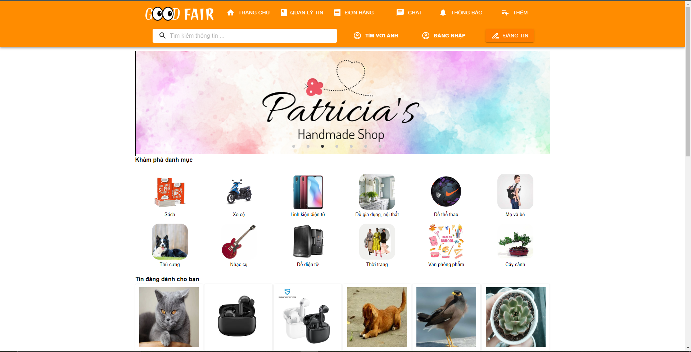

## **Đồ án CÁC CÔNG NGHỆ PHẦN MỀM MỚI (MERN)**

---

## THÔNG TIN CHUNG
- **Tên dự án: Website trao đổi hàng hóa** (dựa trên ứng dụng Chợ tốt)
- Công nghệ sử dụng
    - Front-end (admin page): 
        - ReactJS
        - react-router-dom
        - @mui/material
        - @mui/material-icons
    - Front-end (main page | customer page): 
        - ReactJS
        - react-router-dom
        - @mui/material
        - @mui/material-icons
    - Back-end: 
        - ExpressJS
        - dotenv
        - bcrypt (hash password)
        - cors
        - mongoose
        - multer (upload image)
    - Database: MongoDB

### Thành viên
| MSSV         | Tên               | Công việc                         |
|--------------|-------------------|-----------------------------------|
| 19110426     | Võ Nhật Phi       | Main page + Server models/mongos  |   
| 19110342     | Nguyễn Duy Dương  | Server routes + controllers       |   
| 19110417     | Nguyễn Minh Nhật  | Admin page + test và thêm dữ liệu |

---

## Một số hình ảnh về ứng dụng
### 1. Trang chủ   

### 2. Đăng nhập   

### 3. Đăng ký    

### 4. Trang xem thông tin   

### 5. Quản lý tài khoản     

---

## THÔNG TIN BỔ SUNG
- [Link tài liệu](https://drive.google.com/drive/folders/1GE0JkGc4ClinVZ3PukjvfPX4iqAhyxM8?usp=sharing)
- [File postman](./resources/Good_Fair.postman_collection.json)